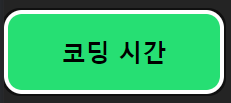

#과제

##코드

```js
import { useState } from "react";

function Coding() {
  const [isActive, setIsActive] = useState(true);

  const CodingTime = isActive ? "Coding" : "Done";

  const handleClick = () => {
    setIsActive(!isActive);
  };

  return (
    <button type="button" className={CodingTime} onClick={handleClick}>
      {CodingTime === "Coding" ? "코딩 시간" : "충전 시간"}
    </button>
  );
}

export default Coding;
```

##결과



