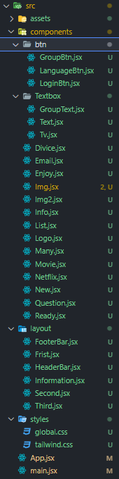
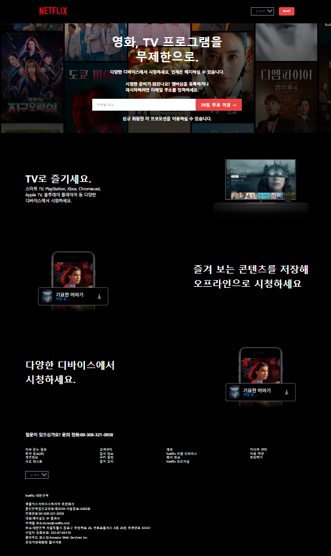

# React 2주차 과제

SPA 를 제작했습니다.
제작 페이지는 Informaiton 페이지입니다.

## 구조

## 결과

느낀점 및 아쉬운 점
수업 시간에 배운내용을 토대로 구현을 해보고 싶었지만... 지나친 욕심에 기능 없이 제작만 해놔서 너무 아쉬웠습니다.

그렇다고 쪼개기를 잘 쪼개놓은거 같지도 않고..
제출하고 나서 보니 너무 엉망이라 너무 많이 아쉽습니다..

이번 과제를 통해 구조는 확실히 알겠는데 실력으로 인해 배운걸 다 이용해보지 못해서 너무 아쉽습니다.

다음 과제는 확실하게 할 수 있는 양을 정하고, 배운걸 모두 넣을 수 있는 과제를 해야겠습니다!
